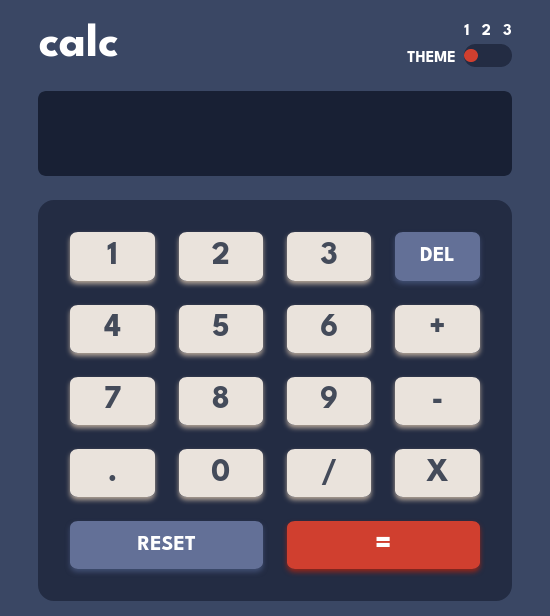
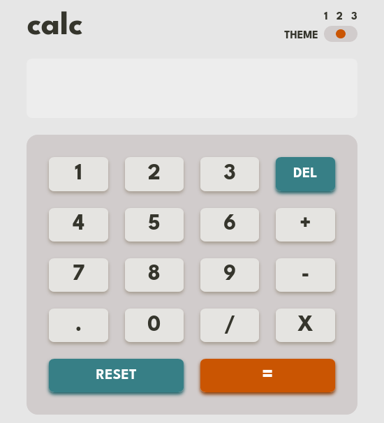
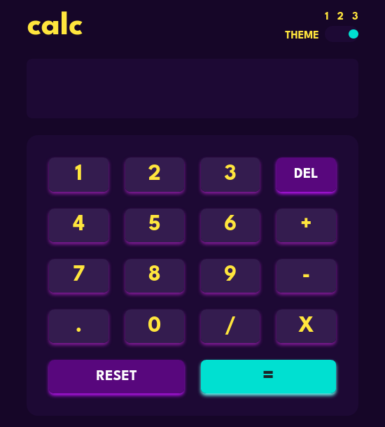

# Frontend Mentor - Calculator app solution

This is a solution to the [Calculator app challenge on Frontend Mentor](https://www.frontendmentor.io/challenges/calculator-app-9lteq5N29). Frontend Mentor challenges help you improve your coding skills by building realistic projects. 

## Table of contents

- [Overview](#overview)
  - [The challenge](#the-challenge)
  - [Screenshot](#screenshot)
  - [Links](#links)
- [My process](#my-process)
  - [Built with](#built-with)
  - [What I learned](#what-i-learned)
  - [Continued development](#continued-development)
- [Author](#author)
- [Acknowledgments](#acknowledgments)


## Overview

### The challenge

Users should be able to:

- See the size of the elements adjust based on their device's screen size
- Perform mathmatical operations like addition, subtraction, multiplication, and division
- Adjust the color theme based on their preference
- **Bonus**: Have their initial theme preference checked using `prefers-color-scheme` and have any additional changes saved in the browser

### Screenshot





### Links

- Solution URL: [git](https://github.com/RadasinR/frontend-calculator.git)
- Live Site URL: [vercel](https://frontend-calculator-ten.vercel.app/)

## My process

### Built with

- Semantic HTML5 markup
- Sass
- Flexbox
- CSS Grid
- Mobile-first workflow

### What I learned

I learn how to use grammar to parse a expression, how to change color themes, how to make tokens, how to design software.


```js
class Token {
  constructor(type, value) {
    this.type = type;
    this.value = value;
  }
}

function tokenize() {
  let tokens = [];
  const operators = /^[-+*\/]$/;
  let token = new Token("Number", "");
  for (const ch of buffer) {
    if (!isNaN(ch) || ch == ".") {
      token.value = token.value + ch;
    } else {
      tokens.push(token);
      if (operators.test(ch)) {
        tokens.push(new Token("op", ch));
      }
      token = new Token("Number", "");
    }
  }
  if (token.value.length > 0) {
    tokens.push(token);
  }
  return tokens;
}

function calc() {
  tokens = tokenize();
  if (tokens.length === 0) {
    return;
  }
  let result = expresion();
  document.querySelector("#screen").innerText = result;
  buffer = "" + result;
}

function getToken() {
  let t = tokens.shift();
  return t;
}

function unget(tk) {
  tokens.unshift(tk);
}

function term() {
  let lv = primary();
  if (lv === undefined) {
    return 1; /* 1 is neutral 1 time any number is that number any number divide bty 1 is that number */
  }
  let op = getToken();
  if (op === undefined) {
    return lv;
  }

  switch (op.value) {
    case "*":
      lv *= term();
      break;
    case "/":
      lv /= term();
      break;
    case "+":
    case "-":
      unget(op);
      break;
  }
  return lv;
}

function primary() {
  let tk = getToken();
  if (tk === undefined) {
    return undefined;
  }

  if (tk.type === "op") {
    throw new Error("Number expected");
  }

  return Number(tk.value);
}

function expresion() {
  try {
    let lv = term();

    tk = getToken();
    if (tk === undefined) {
      return lv;
    }
    switch (tk.value) {
      case "+":
        lv += term();
        break;
      case "-":
        lv -= term();
        break;
      default:
    }
    return lv;
  } catch (error) {
    return error.message;
  }
}
```

### Continued development

Learn more about software design. Learn more about grammar.


## Author

- Frontend Mentor - [@yourusername](https://www.frontendmentor.io/profile/Radasin)


## Acknowledgments

Freecodecamp
